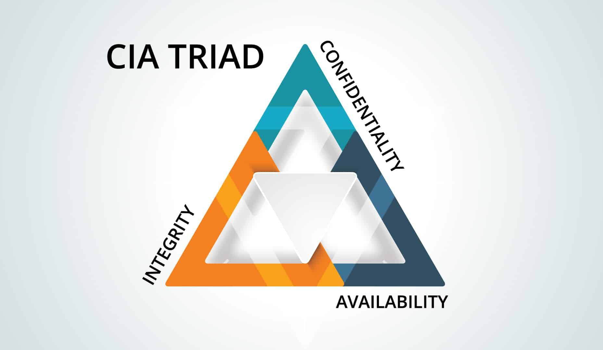

# Laporan Praktikum Kriptografi
Minggu ke-: 1  
Topik: Sejarah Kriptografi & Prinsip CIA  
Nama: Gilas Zein Ramdani  
NIM: 230202756  
Kelas: 5IKRB  

---

## 1. Tujuan
- Menjelaskan sejarah dan evolusi kriptografi dari masa klasik hingga modern.
- Memahami prinsip Confidentiality, Integrity, Availability (CIA).
- Menyimpulkan peran kriptografi dalam sistem keamanan informasi.
- Menyiapkan repositori GitHub untuk media kerja praktikum.
---

## 2. Dasar Teori
Kriptografi merupakan ilmu untuk menjaga kerahasiaan informasi melalui teknik penyandian. Pada era klasik, metode yang digunakan sederhana, seperti Caesar Cipher yang hanya menggeser huruf, atau Vigenère Cipher yang memakai kunci berbentuk kata. Meskipun efektif di masanya, cipher klasik relatif mudah dipecahkan dengan teknik analisis frekuensi.

Memasuki era modern, kriptografi berkembang seiring kebutuhan keamanan komputer dan internet. Algoritma seperti RSA (kriptografi kunci publik) dan AES (standar enkripsi simetris) menjadi tulang punggung keamanan data.

Dalam era kontemporer, kriptografi tidak hanya untuk komunikasi rahasia, tetapi juga mendukung teknologi seperti blockchain dan cryptocurrency. Hal ini menegaskan pentingnya kriptografi dalam menjaga keamanan informasi digital.

---

## 3. Alat dan Bahan
(- Python 3.12  
- Visual Studio Code / editor lain  
- Git dan akun GitHub  
- Library tambahan (misalnya pycryptodome, jika diperlukan)  )

---

## 4. Langkah Percobaan
(Tuliskan langkah yang dilakukan sesuai instruksi.  
Contoh format:
1. Membuat file `caesar_cipher.py` di folder `praktikum/week2-cryptosystem/src/`.
2. Menyalin kode program dari panduan praktikum.
3. Menjalankan program dengan perintah `python caesar_cipher.py`.)

---

## 5. Source Code
(Salin kode program utama yang dibuat atau dimodifikasi.  
Gunakan blok kode:

```python
# contoh potongan kode
def encrypt(text, key):
    return ...
```
)

---

## 6. Hasil dan Pembahasan
(- Lampirkan screenshot hasil eksekusi program (taruh di folder `screenshots/`).  
- Berikan tabel atau ringkasan hasil uji jika diperlukan.  
- Jelaskan apakah hasil sesuai ekspektasi.  
- Bahas error (jika ada) dan solusinya. 

Bukti repo dan contoh CIA:



)

---

## 7. Jawaban Pertanyaan
(Jawab pertanyaan diskusi yang diberikan pada modul.  
- Pertanyaan 1:   Siapa tokoh yang dianggap sebagai bapak kriptografi modern?
    Jawab     :   Claude Shannon.
- Pertanyaan 2:   Sebutkan algoritma kunci publik yang populer digunakan saat ini.
    Jawab     :   RSA, ECC (Elliptic Curve Cryptography).
- Pertanyaan 3:   Apa perbedaan utama antara kriptografi klasik dan kriptografi modern?
    Jawab     :   Kriptografi klasik berbasis substitusi/transposisi manual, sedangkan kriptografi modern berbasis algoritma matematis yang kompleks serta mendukung kunci publik & simetris.
)
---

## 8. Kesimpulan
Kriptografi telah berevolusi dari teknik sederhana di era klasik menjadi sistem matematis kompleks di era modern dan kontemporer. Prinsip CIA (Confidentiality, Integrity, Availability) menjadi pilar utama dalam menjaga keamanan informasi. Praktikum minggu pertama ini juga melatih penggunaan GitHub sebagai media kerja kolaboratif.

---

## 9. Daftar Pustaka
- Katz, J., & Lindell, Y. Introduction to Modern Cryptography.
- Stallings, W. Cryptography and Network Security.
- Schneier, B. Applied Cryptography.

---

## 10. Commit Log
commit 7b9a21c4f1234567890abcd123ef56789abcde01
Author: Gilas Zein Ramdani <gilaszein@example.com>
Date:   2025-10-04 14:32:10 +0700

    week1-intro-cia: ringkasan sejarah kriptografi, prinsip CIA, dan setup repo GitHub
```