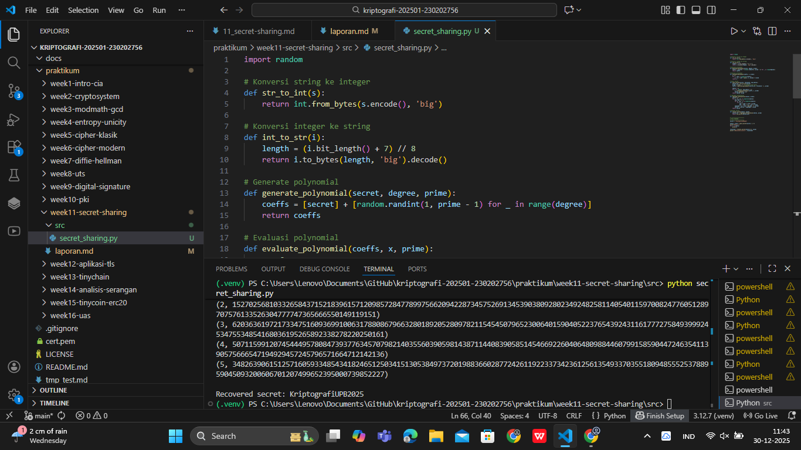

# Laporan Praktikum Kriptografi
Minggu ke-: 11  
Topik: Shamir’s Secret Sharing  
Nama: Gilas Zein Ramdani  
NIM: 230202756  
Kelas: 5IKRB

---

## 1. Tujuan
Tujuan dari praktikum ini adalah untuk memahami konsep Shamir’s Secret Sharing (SSS), mengimplementasikan mekanisme pembagian rahasia ke dalam beberapa bagian (shares), serta melakukan rekonstruksi rahasia menggunakan ambang batas (threshold) tertentu. Selain itu, praktikum ini bertujuan untuk menganalisis aspek keamanan dari skema distribusi rahasia.

---

## 2. Dasar Teori
Shamir’s Secret Sharing (SSS) merupakan salah satu skema kriptografi yang digunakan untuk membagi suatu rahasia menjadi beberapa bagian yang disebut shares. Rahasia tersebut hanya dapat direkonstruksi apabila sejumlah minimal shares (threshold k) digabungkan. Skema ini diperkenalkan oleh Adi Shamir pada tahun 1979.

SSS memanfaatkan konsep polinomial pada aritmetika modular. Rahasia disimpan sebagai konstanta dari suatu polinomial berderajat (k−1), sedangkan koefisien lainnya dipilih secara acak. Setiap share merupakan pasangan nilai (x, y) yang dihasilkan dari evaluasi polinomial tersebut pada titik x tertentu.

Keamanan Shamir’s Secret Sharing bersifat information-theoretic secure, artinya tanpa jumlah shares yang mencukupi, tidak ada informasi tentang rahasia yang dapat diperoleh. Dengan kurang dari k shares, terdapat banyak kemungkinan polinomial yang valid sehingga rahasia tidak dapat ditebak.

---

## 3. Alat dan Bahan
(- Python 3.12  
- Visual Studio Code / editor lain  
- Git dan akun GitHub  
- Library tambahan (misalnya pycryptodome, jika diperlukan)  )

---

## 4. Langkah Percobaan
(Tuliskan langkah yang dilakukan sesuai instruksi.  
Contoh format:
1. Membuat file `secret_sharing.py` di folder `praktikum/week11-secret-sharing/src/`.
2. Menyalin kode program dari panduan praktikum.
3. Menjalankan program dengan perintah `python secret_sharing.py`.)

---

## 5. Source Code
(Salin kode program utama yang dibuat atau dimodifikasi.  
Gunakan blok kode:

```python
import random

# Konversi string ke integer
def str_to_int(s):
    return int.from_bytes(s.encode(), 'big')

# Konversi integer ke string
def int_to_str(i):
    length = (i.bit_length() + 7) // 8
    return i.to_bytes(length, 'big').decode()

# Generate polynomial
def generate_polynomial(secret, degree, prime):
    coeffs = [secret] + [random.randint(1, prime - 1) for _ in range(degree)]
    return coeffs

# Evaluasi polynomial
def evaluate_polynomial(coeffs, x, prime):
    y = 0
    for i, coef in enumerate(coeffs):
        y = (y + coef * pow(x, i, prime)) % prime
    return y

# Split secret
def split_secret(secret, threshold, num_shares):
    secret_int = str_to_int(secret)
    prime = 2**521 - 1  # bilangan prima besar
    coeffs = generate_polynomial(secret_int, threshold - 1, prime)

    shares = []
    for x in range(1, num_shares + 1):
        y = evaluate_polynomial(coeffs, x, prime)
        shares.append((x, y))
    return shares, prime

# Lagrange interpolation
def lagrange_interpolation(shares, prime):
    secret = 0
    for j, (xj, yj) in enumerate(shares):
        num, den = 1, 1
        for m, (xm, _) in enumerate(shares):
            if m != j:
                num = (num * (-xm)) % prime
                den = (den * (xj - xm)) % prime
        lagrange = yj * num * pow(den, -1, prime)
        secret = (secret + lagrange) % prime
    return secret

# Recover secret
def recover_secret(shares, prime):
    secret_int = lagrange_interpolation(shares, prime)
    return int_to_str(secret_int)


# ======================
# MAIN PROGRAM
# ======================
secret = "KriptografiUPB2025"

shares, prime = split_secret(secret, 3, 5)
print("Shares:")
for s in shares:
    print(s)

recovered = recover_secret(shares[:3], prime)
print("\nRecovered secret:", recovered)
```
)

---

## 6. Hasil dan Pembahasan
(- Lampirkan screenshot hasil eksekusi program (taruh di folder `screenshots/`).  
- Berikan tabel atau ringkasan hasil uji jika diperlukan.  
- Jelaskan apakah hasil sesuai ekspektasi.  
- Bahas error (jika ada) dan solusinya. 

Hasil eksekusi program Caesar Cipher:


)

---

## 7. Jawaban Pertanyaan
- Pertanyaan 1: Apa keuntungan utama Shamir Secret Sharing dibanding membagikan salinan kunci secara langsung?
- Jawab       : Keuntungan utama SSS adalah peningkatan keamanan karena rahasia tidak disimpan secara utuh di satu pihak, sehingga mengurangi risiko kebocoran.
- Pertanyaan 2: Apa peran threshold (k) dalam keamanan secret sharing?
- Jawab       : Threshold menentukan jumlah minimal shares yang dibutuhkan untuk merekonstruksi rahasia dan berperan penting dalam keseimbangan antara keamanan dan ketersediaan.
- Pertanyaan 3: Berikan satu contoh penerapan Shamir Secret Sharing.
- Jawab       : SSS digunakan dalam manajemen kunci cryptocurrency, di mana private key dibagi kepada beberapa pihak.
---

## 8. Kesimpulan
Shamir’s Secret Sharing merupakan metode yang aman dan efektif untuk distribusi rahasia. Praktikum ini membuktikan bahwa rahasia dapat dibagi dan direkonstruksi sesuai teori kriptografi menggunakan pendekatan polinomial.

---

## 9. Daftar Pustaka
(Cantumkan referensi yang digunakan.  
Contoh:  
- Katz, J., & Lindell, Y. *Introduction to Modern Cryptography*.  
- Stallings, W. *Cryptography and Network Security*.  )

---

## 10. Commit Log
```
commit adcc719e8937c7bf0140f66c71b3092fc38956e3 (HEAD -> main, origin/main, origin/HEAD)
Author: gilaszeinramdani <gilaszeinramdani@gmail.com>
Date:   Tue Dec 30 11:52:21 2025 +0700

    week11-secret-sharing
```
