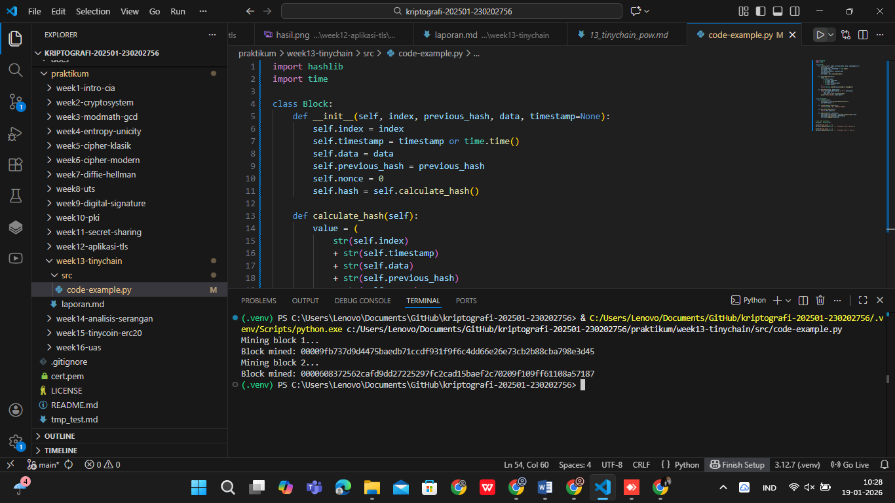

# Laporan Praktikum Kriptografi
Minggu ke-: 13  
Topik: TinyChain – Proof of Work (PoW)
Nama: Gilas Zein Ramdani  
NIM: 230202756  
Kelas: 5IKRB 

---

## 1. Tujuan
Tujuan dari praktikum ini adalah untuk memahami peran fungsi hash dalam blockchain, melakukan simulasi mekanisme Proof of Work (PoW), serta menganalisis aspek keamanan cryptocurrency berbasis kriptografi.

---

## 2. Dasar Teori
Blockchain merupakan sistem pencatatan terdistribusi yang menyimpan data dalam bentuk blok yang saling terhubung menggunakan fungsi hash kriptografi. Setiap blok memiliki hash unik yang bergantung pada isi data, waktu pembuatan, nonce, dan hash blok sebelumnya. Hal ini menjamin integritas data karena perubahan kecil pada data akan menghasilkan hash yang berbeda.

Proof of Work (PoW) adalah mekanisme konsensus yang digunakan untuk menambahkan blok baru ke dalam blockchain. Pada PoW, miner harus mencari nilai nonce yang menghasilkan hash dengan pola tertentu, misalnya diawali sejumlah nol. Proses ini membutuhkan usaha komputasi sehingga menyulitkan pemalsuan data.
---

## 3. Alat dan Bahan
(- Python 3.12  
- Visual Studio Code / editor lain  
- Git dan akun GitHub  
- Library tambahan (misalnya pycryptodome, jika diperlukan)  )

---

## 4. Langkah Percobaan
(Tuliskan langkah yang dilakukan sesuai instruksi.  
Contoh format:
1. Membuat file `tinychain.py` di folder `praktikum/week13-tinychain/src/`.
2. Menyalin kode program dari panduan praktikum.
3. Menjalankan program dengan perintah `python tinychain.py`.)

---

## 5. Source Code
(Salin kode program utama yang dibuat atau dimodifikasi.  
Gunakan blok kode:

```python
import hashlib
import time

class Block:
    def __init__(self, index, previous_hash, data, timestamp=None):
        self.index = index
        self.timestamp = timestamp or time.time()
        self.data = data
        self.previous_hash = previous_hash
        self.nonce = 0
        self.hash = self.calculate_hash()

    def calculate_hash(self):
        value = (
            str(self.index)
            + str(self.timestamp)
            + str(self.data)
            + str(self.previous_hash)
            + str(self.nonce)
        )
        return hashlib.sha256(value.encode()).hexdigest()

    def mine_block(self, difficulty):
        while self.hash[:difficulty] != "0" * difficulty:
            self.nonce += 1
            self.hash = self.calculate_hash()
        print(f"Block mined: {self.hash}")


class Blockchain:
    def __init__(self):
        self.chain = [self.create_genesis_block()]
        self.difficulty = 4

    def create_genesis_block(self):
        return Block(0, "0", "Genesis Block")

    def get_latest_block(self):
        return self.chain[-1]

    def add_block(self, new_block):
        new_block.previous_hash = self.get_latest_block().hash
        new_block.mine_block(self.difficulty)
        self.chain.append(new_block)


# Uji coba blockchain
my_chain = Blockchain()

print("Mining block 1...")
my_chain.add_block(Block(1, "", "Transaksi A → B: 10 Coin"))

print("Mining block 2...")
my_chain.add_block(Block(2, "", "Transaksi B → C: 5 Coin"))
```
)

---

## 6. Hasil dan Pembahasan
(- Lampirkan screenshot hasil eksekusi program (taruh di folder `screenshots/`).  
- Berikan tabel atau ringkasan hasil uji jika diperlukan.  
- Jelaskan apakah hasil sesuai ekspektasi.  
- Bahas error (jika ada) dan solusinya. 

Hasil eksekusi program Caesar Cipher:


)

---

## 7. Jawaban Pertanyaan
- Pertanyaan 1: Mengapa fungsi hash sangat penting dalam blockchain?
- Jawab       : Fungsi hash menjamin integritas data dan menghubungkan setiap blok secara kriptografis sehingga perubahan data dapat terdeteksi.
- Pertanyaan 2: Bagaimana Proof of Work mencegah double spending?
- Jawab       : PoW mempersulit pemalsuan transaksi karena setiap perubahan data memerlukan proses mining ulang yang mahal secara komputasi.
- Pertanyaan 3: Apa kelemahan PoW dalam hal efisiensi energi?
- Jawab       : PoW membutuhkan daya komputasi dan energi listrik yang besar sehingga kurang efisien dan berdampak pada lingkungan.
---

## 8. Kesimpulan
Dari praktikum ini dapat disimpulkan bahwa fungsi hash dan Proof of Work merupakan komponen utama dalam menjaga keamanan blockchain. Meskipun efektif, PoW memiliki kelemahan dalam konsumsi energi yang tinggi.
---

## 9. Daftar Pustaka
(Cantumkan referensi yang digunakan.  
Contoh:  
- Katz, J., & Lindell, Y. *Introduction to Modern Cryptography*.  
- Stallings, W. *Cryptography and Network Security*.  )

---

## 10. Commit Log
```
commit e76f22f6f29b55e64aa811040198e837bcddd0f1 (HEAD -> main, origin/main, origin/HEAD)
Author: gilaszeinramdani <gilaszeinramdani@gmail.com>
Date:   Mon Jan 19 10:33:25 2026 +0700

    week13-tinychain
```
