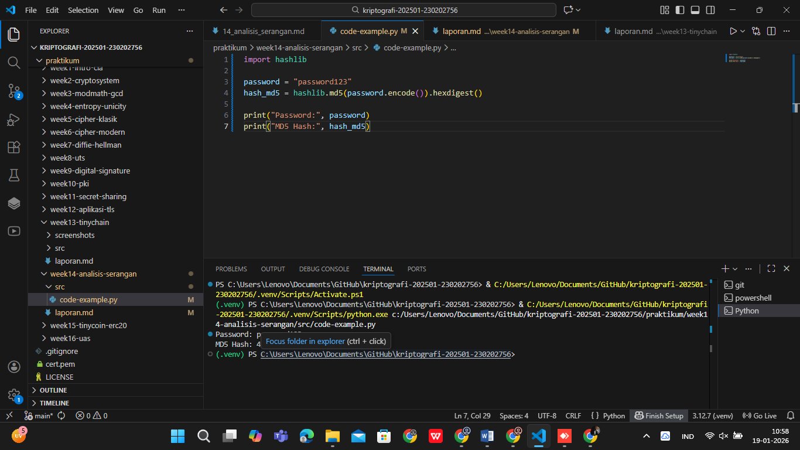

# Laporan Praktikum Kriptografi
Minggu ke-: 14  
Topik: Analisis Serangan Kriptografi  
Nama: Gilas Zein Ramdani  
NIM: 230202756  
Kelas: 5IKRB  

---

## 1. Tujuan
Tujuan dari praktikum ini adalah untuk mengidentifikasi jenis serangan kriptografi pada sistem informasi nyata, menganalisis kelemahan algoritma atau implementasi kriptografi yang digunakan, serta memberikan rekomendasi solusi atau algoritma kriptografi yang lebih aman guna meningkatkan keamanan sistem.

---

## 2. Dasar Teori
Kriptografi merupakan teknik untuk melindungi informasi dengan cara mengubah data menjadi bentuk yang tidak dapat dipahami oleh pihak yang tidak berwenang. Dalam praktiknya, kriptografi digunakan untuk menjaga kerahasiaan, integritas, autentikasi, dan non-repudiasi data. Algoritma kriptografi yang umum digunakan meliputi algoritma hash, kriptografi kunci simetris, dan kriptografi kunci asimetris.

Serangan kriptografi terjadi ketika penyerang mengeksploitasi kelemahan pada algoritma, implementasi, atau konfigurasi sistem. Contoh serangan yang sering terjadi adalah brute force attack dan dictionary attack terhadap password yang menggunakan algoritma hash lemah seperti MD5. Algoritma MD5 sudah dianggap tidak aman karena rentan terhadap collision dan dapat dipecahkan dengan bantuan komputasi modern.

Untuk mengatasi permasalahan tersebut, diperlukan algoritma yang lebih kuat dan mekanisme tambahan seperti salting dan key stretching. Algoritma hash modern seperti SHA-256 dan fungsi hashing password seperti bcrypt, scrypt, atau Argon2 dirancang untuk meningkatkan ketahanan terhadap serangan brute force dan dictionary attack.

---

## 3. Alat dan Bahan
- Python 3.12.7  
- Visual Studio Code / editor lain  
- Git dan akun GitHub  
- Library tambahan (misalnya pycryptodome, jika diperlukan)  

---

## 4. Langkah Percobaan
(Tuliskan langkah yang dilakukan sesuai instruksi.  
Contoh format:
1. Membuat file `caesar_cipher.py` di folder `praktikum/week2-cryptosystem/src/`.
2. Menyalin kode program dari panduan praktikum.
3. Menjalankan program dengan perintah `python caesar_cipher.py`.)

---

## 5. Source Code
(Salin kode program utama yang dibuat atau dimodifikasi.  
Gunakan blok kode:

```python
import hashlib

password = "password123"
hash_md5 = hashlib.md5(password.encode()).hexdigest()

print("Password:", password)
print("MD5 Hash:", hash_md5)
```
)

---

## 6. Hasil dan Pembahasan
(- Lampirkan screenshot hasil eksekusi program (taruh di folder `screenshots/`).  
- Berikan tabel atau ringkasan hasil uji jika diperlukan.  
- Jelaskan apakah hasil sesuai ekspektasi.  
- Bahas error (jika ada) dan solusinya. 

Hasil eksekusi program Caesar Cipher:


)

---

## 7. Jawaban Pertanyaan  
- Pertanyaan 1: Mengapa banyak sistem lama masih rentan terhadap brute force atau dictionary attack?  
  Karena banyak sistem lama masih menggunakan algoritma kriptografi yang sudah usang seperti MD5 atau SHA-1, serta tidak menerapkan mekanisme keamanan tambahan seperti salting dan rate limiting. Selain itu, keterbatasan sumber daya dan kurangnya pembaruan sistem juga menjadi faktor utama.
- Pertanyaan 2: Apa bedanya kelemahan algoritma dengan kelemahan implementasi?  
  Kelemahan algoritma berkaitan dengan desain matematis algoritma itu sendiri, seperti collision pada MD5. Sementara itu, kelemahan implementasi terjadi akibat kesalahan penerapan algoritma, misalnya penyimpanan password tanpa salt atau konfigurasi sistem yang tidak aman.
- Pertanyaan 3: Bagaimana organisasi dapat memastikan sistem kriptografi mereka tetap aman di masa depan?  
  Organisasi harus secara rutin melakukan audit keamanan, memperbarui algoritma kriptografi sesuai standar terbaru, menerapkan best practice keamanan, serta mengikuti perkembangan riset dan rekomendasi dari komunitas keamanan.

---

## 8. Kesimpulan
Berdasarkan hasil analisis, dapat disimpulkan bahwa penggunaan algoritma kriptografi yang lemah seperti MD5 sangat berisiko terhadap serangan brute force dan dictionary attack. Oleh karena itu, diperlukan penggunaan algoritma yang lebih aman serta konfigurasi sistem yang tepat untuk meningkatkan keamanan informasi.

---

## 9. Daftar Pustaka
(Cantumkan referensi yang digunakan.  
Contoh:  
- Katz, J., & Lindell, Y. *Introduction to Modern Cryptography*.  
- Stallings, W. *Cryptography and Network Security*.  )

---

## 10. Commit Log
```
commit 0e0c4422d423db25ca6c406665852187fec80827 (HEAD -> main, origin/main, origin/HEAD)
Author: gilaszeinramdani <gilaszeinramdani@gmail.com>
Date:   Mon Jan 19 11:09:19 2026 +0700

    week14-analisis-serangan
```
