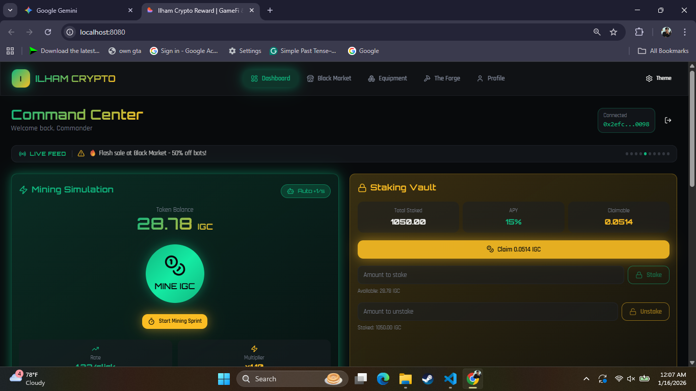
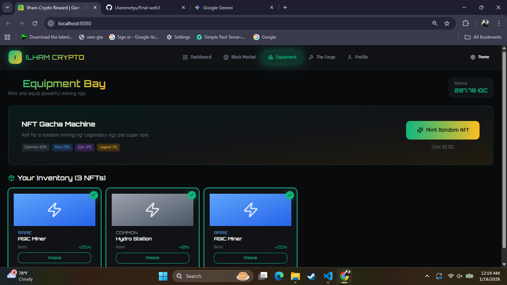
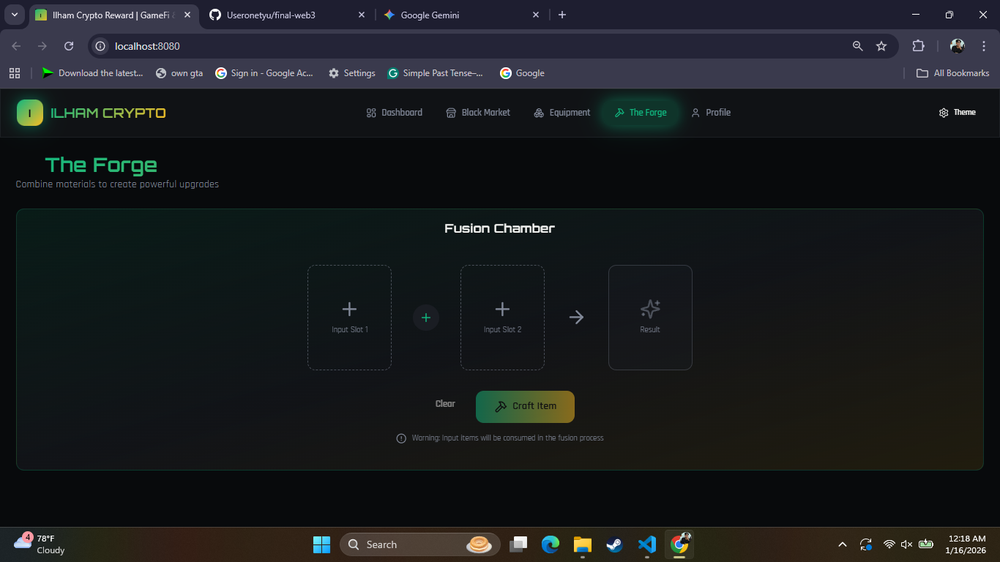
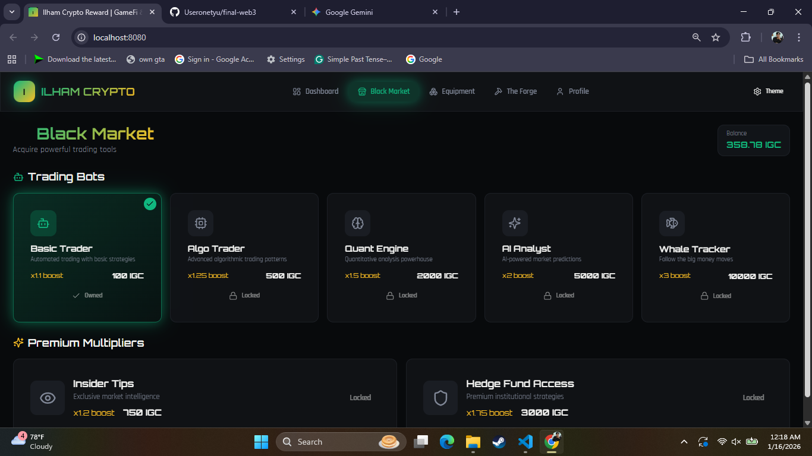

# Ilham Tycoon - GameFi & Crypto Ecosystem Simulation


**Ilham Tycoon** is a web-based simulation platform designed to demonstrate the fundamental concepts of Cryptography and Blockchain Economics (GameFi). Built as a final project for the Cryptography course, this application simulates a closed-loop economy involving Token Mining, Staking (DeFi), NFT Crafting, and Asset Trading.

## 👤 Author Information

* **Name:** Gilas Zein Ramdani
* **Student ID (NIM):** 230202756
* **Class:** 5IKRB
* **Institution:** Universitas Putra Bangsa
* **Subject:** Cryptography
* **Kelompok:** Kelompok 1
* **Kontribusi:** PPt

---

## 🚀 Key Features

### 1. ⛏️ Mining Simulation (Proof-of-Work Concept)
* **Manual Mining:** Users click to "mine" **Ilham Game Coin (IGC)**. This simulates the computational effort required to validate blocks.
* **Visual Feedback:** Particle effects and animations represent the hashing process.
* **Auto-Mining:** Purchase "Trading Bots" to automate the mining process, simulating passive node validation.

### 2. 🏦 Staking Vault (Proof-of-Stake Concept)
* **DeFi Simulation:** Users can lock their IGC tokens into a smart vault.
* **APY Calculation:** The system calculates passive rewards based on the staked amount and time elapsed, demonstrating the *Time Value of Money* and validator incentives.

### 3. 🛒 Black Market (Token Utility)
* **Trading Bots:** Purchase automated miners (Basic Trader, Algo Trader, Whale Tracker).
* **Smart Contract Logic:** Simulates a transaction where tokens are burned (deducted) in exchange for feature access (state updates).

### 4. ⚒️ The Forge (NFT & Crafting)
* **Asset Fusion:** Combine two basic items (e.g., Raw Silicon + Fan) to mint a new, rarer asset (e.g., Super GPU).
* **Minting Animation:** Visualizes the creation of new digital assets on the blockchain.

### 5. 🏆 Gamification
* **Achievements:** Badges unlock based on milestones (e.g., "Novice Miner" at 1000 clicks).
* **Leaderboard:** Displays top miners to simulate network competition.
* **Persistency:** Mock wallet connection (`0x...`) simulation.

---

## 🛠️ Technology Stack

* **Frontend:** [React.js](https://reactjs.org/) (Vite)
* **Styling:** [Tailwind CSS](https://tailwindcss.com/)
* **UI Components:** [Shadcn UI](https://ui.shadcn.com/) & [Lucide React](https://lucide.dev/)
* **Logic:** JavaScript (ES6+) for simulation algorithms.
* **Simulation Lib:** Ethers.js mock implementation.

---

## 📸 Screenshots

| Dashboard | Staking Vault |
|:---------:|:-------------:|
|  |  |

| The Forge | Black Market |
|:---------:|:------------:|
|  |  |

> *Note: Screenshots represent the simulation interface running on localhost.*

---

## 📦 Installation & Setup

Follow these steps to run the project locally:

1.  **Clone the repository**
    ```bash
    git clone [https://github.com/Useronetyu/final-web3.git](https://github.com/Useronetyu/final-web3.git)
    cd final-web3
    ```

2.  **Install Dependencies**
    ```bash
    npm install
    ```

3.  **Run the Development Server**
    ```bash
    npm run dev
    ```

4.  **Open in Browser**
    Navigate to `http://localhost:8080` (or the port shown in your terminal).

---

## 📄 License & Academic Integrity

This project is created for educational purposes as part of the Cryptography curriculum. All "coins" and "transactions" are simulations and hold no real-world monetary value.

---

*Built with ❤️ by Ilham.*