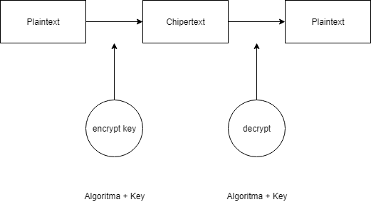
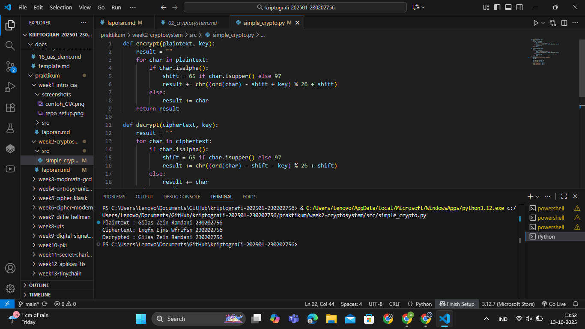

# Laporan Praktikum Kriptografi
Minggu ke-: 2  
Topik: Cryptosystem (Komponen, Enkripsi & Dekripsi, Simetris & Asimetris)
Nama: Gilas Zein Ramdani  
NIM: 230202756
Kelas: 5IKRB

---

## 1. Tujuan
1. Mengidentifikasi komponen dasar kriptosistem (plaintext, ciphertext, kunci, algoritma).  
2. Menggambarkan proses enkripsi dan dekripsi sederhana.  
3. Mengklasifikasikan jenis kriptosistem (simetris dan asimetris). 

---

## 2. Dasar Teori
Kriptografi merupakan ilmu yang mempelajari cara mengamankan data dengan mengubah bentuk informasi asli (plaintext) menjadi bentuk yang tidak dapat dibaca tanpa kunci tertentu (ciphertext). Proses ini disebut enkripsi, sedangkan proses mengembalikan ciphertext menjadi plaintext disebut dekripsi. Dengan demikian, kriptografi berfungsi menjaga kerahasiaan, integritas, serta keaslian data selama proses komunikasi atau penyimpanan berlangsung.

Sebuah kriptosistem terdiri dari empat komponen utama, yaitu plaintext, ciphertext, algoritma kriptografi, dan kunci. Algoritma kriptografi menentukan cara kerja proses enkripsi dan dekripsi, sedangkan kunci berperan sebagai parameter unik yang menjaga keamanan sistem. Tanpa kunci yang benar, pesan tidak dapat dikembalikan ke bentuk aslinya.

Secara umum, kriptografi dibagi menjadi dua jenis, yaitu kriptografi simetris dan kriptografi asimetris. Kriptografi simetris menggunakan satu kunci yang sama untuk proses enkripsi dan dekripsi, seperti pada algoritma Caesar Cipher atau DES. Sementara itu, kriptografi asimetris menggunakan dua kunci berbeda, yaitu kunci publik dan kunci privat, seperti pada algoritma RSA. Perbedaan mendasar ini membuat sistem asimetris lebih aman untuk distribusi kunci, meskipun membutuhkan waktu komputasi yang lebih besar.

---

## 3. Alat dan Bahan
(- Python 3.12  
- Visual Studio Code / editor lain  
- Git dan akun GitHub  
- praktikum/week2-cryptosystem/

---

## 4. Langkah Percobaan
(Tuliskan langkah yang dilakukan sesuai instruksi.  
Contoh format:
1. Membuat file `simple_crypto.py` di folder `praktikum/week2-cryptosystem/src/`.
2. Menyalin kode program dari panduan praktikum.
3. Menjalankan program dengan perintah `python simple_crypto.py`.)
---

## 5. Source Code
(Salin kode program utama yang dibuat atau dimodifikasi.  
Gunakan blok kode:

```python
def encrypt(plaintext, key):
    result = ""
    for char in plaintext:
        if char.isalpha():
            shift = 65 if char.isupper() else 97
            result += chr((ord(char) - shift + key) % 26 + shift)
        else:
            result += char
    return result

def decrypt(ciphertext, key):
    result = ""
    for char in ciphertext:
        if char.isalpha():
            shift = 65 if char.isupper() else 97
            result += chr((ord(char) - shift - key) % 26 + shift)
        else:
            result += char
    return result

if __name__ == "__main__":
    message = "Cryptosystem Test"
    key = 5

    enc = encrypt(message, key)
    dec = decrypt(enc, key)

    print("Plaintext :", message)
    print("Ciphertext:", enc)
    print("Decrypted :", dec)
```
)

---

## 6. Hasil dan Pembahasan
(- Lampirkan screenshot hasil eksekusi program (taruh di folder `screenshots/`).  
- Berikan tabel atau ringkasan hasil uji jika diperlukan.  
- Jelaskan apakah hasil sesuai ekspektasi.  
- Bahas error (jika ada) dan solusinya. 

Lampiran diagram kriptosistem dan screenshot hasil eksekusi program simple Crypto



)

---

## 7. Jawaban Pertanyaan
(Jawab pertanyaan diskusi yang diberikan pada modul.  
- Pertanyaan 1: Sebutkan komponen utama dalam kriptosistem.
- Jawab       : Plaintext, Ciphertext, Kunci, dan Algoritma.
- Pertanyaan 2: Apa kelebihan dan kelemahan sistem simetris dibandingkan asimetris?
- Jawab       : Sistem simetris lebih cepat dan efisien, tetapi kurang aman dalam distribusi kunci. Sedangkan sistem asimetris lebih aman namun membutuhkan waktu proses lebih lama.
- Pertanyaan 2: Mengapa distribusi kunci menjadi masalah utama dalam kriptografi simetris?
- Jawab       : Karena kunci harus dikirimkan ke penerima secara aman. Jika kunci tersebut bocor, pihak lain bisa mendekripsi pesan yang terenkripsi.
)
---

## 8. Kesimpulan
Praktikum ini memperlihatkan bagaimana kriptosistem bekerja menggunakan algoritma sederhana Caesar Cipher. Mahasiswa dapat memahami komponen dasar kriptografi serta perbedaan antara kriptosistem simetris dan asimetris.

---

## 9. Daftar Pustaka


---

## 10. Commit Log
commit 3197da24342e1c5016ce1950486bd613b2655fa8 (HEAD -> main, origin/main, origin/HEAD)
Author: gilaszeinramdani <gilaszeinramdani@gmail.com>
Date:   Sat Oct 11 16:09:35 2025 +0700

    week2-cryptosystem
```
