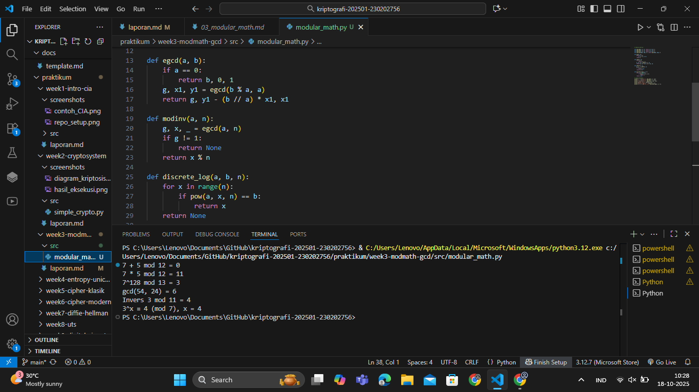

# Laporan Praktikum Kriptografi
Minggu ke-: 3  
Topik: Modular Math, GCD, Bilangan Prima, dan Logaritma Diskrit  
Nama: Gilas Zein Ramdani  
NIM: 230202756
Kelas: 5IKRB 

---

## 1. Tujuan
1.  Menyelesaikan operasi aritmetika modular.
2.  Menentukan bilangan prima dan menghitung GCD menggunakan algoritma Euclidean.
3.  Menemukan invers modular dengan Extended Euclidean Algorithm.
4.  Mensimulasikan logaritma diskrit sederhana dalam konteks kriptografi.

---

## 2. Dasar Teori
Aritmetika modular merupakan sistem operasi bilangan di mana hasil perhitungan dibatasi oleh suatu bilangan modulus n. Operasi seperti penjumlahan, pengurangan, perkalian, dan perpangkatan dilakukan dengan mengambil sisa pembagian terhadap n. Konsep ini menjadi dasar bagi banyak algoritma kriptografi modern, termasuk RSA dan Diffie-Hellman.

Algoritma Euclidean digunakan untuk mencari pembagi bersama terbesar (GCD) antara dua bilangan. Extended Euclidean Algorithm memperluas konsep tersebut untuk menemukan koefisien yang dapat digunakan mencari invers modular, yang penting dalam proses dekripsi.

Sementara itu, logaritma diskrit mencari eksponen x pada persamaan a^x ≡ b (mod n). Untuk modulus besar, perhitungannya sangat sulit dilakukan secara efisien, sehingga menjadi dasar keamanan sistem kriptografi berbasis kunci publik.

---

## 3. Alat dan Bahan
(- Python 3.12  
- Visual Studio Code / editor lain  
- Git dan akun GitHub  
- Library tambahan (misalnya pycryptodome, jika diperlukan)  )

---

## 4. Langkah Percobaan
(Tuliskan langkah yang dilakukan sesuai instruksi.  
Contoh format:
1. Membuat file `modular_math.py` di folder `praktikum/week3-modmath-gcd/src/`.
2. Menyalin kode program dari panduan praktikum.
3. Menjalankan program dengan perintah `python modular_math.py`.)

---

## 5. Source Code
(Salin kode program utama yang dibuat atau dimodifikasi.  
Gunakan blok kode:

```python
# modular_math.py

def mod_add(a, b, n): return (a + b) % n
def mod_sub(a, b, n): return (a - b) % n
def mod_mul(a, b, n): return (a * b) % n
def mod_exp(base, exp, n): return pow(base, exp, n)

def gcd(a, b):
    while b != 0:
        a, b = b, a % b
    return a

def egcd(a, b):
    if a == 0:
        return b, 0, 1
    g, x1, y1 = egcd(b % a, a)
    return g, y1 - (b // a) * x1, x1

def modinv(a, n):
    g, x, _ = egcd(a, n)
    if g != 1:
        return None
    return x % n

def discrete_log(a, b, n):
    for x in range(n):
        if pow(a, x, n) == b:
            return x
    return None

# Contoh eksekusi
print("7 + 5 mod 12 =", mod_add(7, 5, 12))
print("7 * 5 mod 12 =", mod_mul(7, 5, 12))
print("7^128 mod 13 =", mod_exp(7, 128, 13))
print("gcd(54, 24) =", gcd(54, 24))
print("Invers 3 mod 11 =", modinv(3, 11))
print("3^x ≡ 4 (mod 7), x =", discrete_log(3, 4, 7))

```
)

---

## 6. Hasil dan Pembahasan
(- Lampirkan screenshot hasil eksekusi program (taruh di folder `screenshots/`).  
- Berikan tabel atau ringkasan hasil uji jika diperlukan.  
- Jelaskan apakah hasil sesuai ekspektasi.  
- Bahas error (jika ada) dan solusinya. 

Hasil eksekusi program Caesar Cipher:


)

---

## 7. Jawaban Pertanyaan
- Pertanyaan 1: Peran aritmetika modular dalam kriptografi modern:
- Jawab       : Aritmetika modular memungkinkan perhitungan yang aman dan efisien pada sistem bilangan terbatas. Hampir semua algoritma kriptografi modern seperti RSA dan ECC bergantung pada operasi modular untuk menjaga keamanan data.
- Pertanyaan 2: Mengapa invers modular penting dalam algoritma kunci publik (misalnya RSA)?
- Jawab       : Karena enkripsi dan dekripsi menggunakan pasangan eksponen yang merupakan invers modular satu sama lain terhadap φ(n). Tanpa invers modular, proses dekripsi tidak dapat dilakukan dengan benar.
- Pertanyaan 2: Apa tantangan utama dalam menyelesaikan logaritma diskrit untuk modulus besar?
- Jawab       : Kompleksitas komputasi yang sangat tinggi. Tidak ada algoritma efisien yang mampu menghitung logaritma diskrit untuk bilangan besar, sehingga inilah yang menjamin keamanan algoritma kriptografi berbasis logaritma diskrit.
---

## 8. Kesimpulan
Melalui praktikum ini, mahasiswa memahami dan mampu mengimplementasikan operasi aritmetika modular, algoritma Euclidean, serta logaritma diskrit menggunakan Python. Semua fungsi berhasil dijalankan dan hasilnya sesuai dengan teori dasar kriptografi modern.

---

## 9. Daftar Pustaka
(Cantumkan referensi yang digunakan.  
Contoh:  
- Katz, J., & Lindell, Y. *Introduction to Modern Cryptography*.  
- Stallings, W. *Cryptography and Network Security*.  )

---

## 10. Commit Log
commit e6853787dbe3f13c70e0ba239102038376ef989c (HEAD -> main, origin/main, origin/HEAD)
Author: gilaszeinramdani <gilaszeinramdani@gmail.com>
Date:   Sat Oct 18 10:37:00 2025 +0700

    week3-modmath-gcd
```
