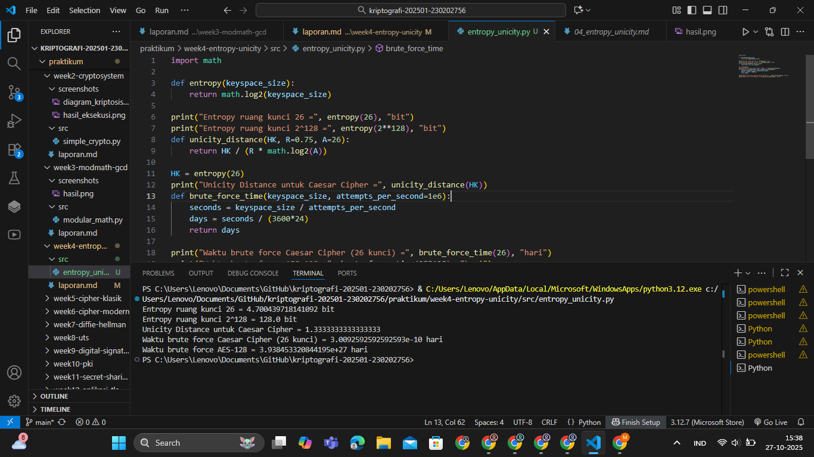

# Laporan Praktikum Kriptografi
Minggu ke-: 4  
Topik: Entropy & Unicity Distance (Evaluasi Kekuatan Kunci dan Brute Force)
Nama: Gilas Zein Ramdani
NIM: 230202756
Kelas: 5IKRB

---

## 1. Tujuan
1. Menyelesaikan perhitungan sederhana terkait entropi kunci.
2. Menggunakan teorema Euler pada contoh perhitungan modular & invers.
3. Menghitung *unicity distance* untuk ciphertext tertentu.
4. Menganalisis kekuatan kunci berdasarkan entropi dan *unicity distance*.
5. Mengevaluasi potensi serangan *brute force* pada kriptosistem sederhana.

---

## 2. Dasar Teori
Entropi (H(K))** menggambarkan tingkat ketidakpastian atau banyaknya kemungkinan dalam ruang kunci. Semakin besar nilai entropi, semakin kuat suatu sistem karena kunci sulit ditebak. Rumus dasar entropi:
\[
H(K) = \log_2 |K|
\]
dengan \(|K|\) adalah ukuran ruang kunci.

**Unicity Distance (U)** digunakan untuk menentukan seberapa panjang ciphertext yang dibutuhkan agar penyerang dapat memecahkan pesan secara unik. Rumusnya:
\[
U = \frac{H(K)}{R \cdot \log_2 |A|}
\]
dengan \(R\) adalah redundansi bahasa dan \(|A|\) adalah ukuran alfabet.

**Brute Force Attack** merupakan metode serangan paling sederhana di mana penyerang mencoba semua kemungkinan kunci hingga menemukan hasil yang benar. Waktu serangan bergantung pada ukuran ruang kunci dan kecepatan komputasi.

---

## 3. Alat dan Bahan
(- Python 3.12  
- Visual Studio Code / editor lain  
- Git dan akun GitHub  
- Library tambahan (math)  )

---

## 4. Langkah Percobaan
(Tuliskan langkah yang dilakukan sesuai instruksi.  
Contoh format:
1. Membuat file `entropy_unicity.py` di folder `praktikum/week4-entropy-unicity/src/`.
2. Menyalin kode program dari panduan praktikum.
3. Menjalankan program dengan perintah `python entropy_unicity.py`.)

---

## 5. Source Code
(Salin kode program utama yang dibuat atau dimodifikasi.  
Gunakan blok kode:

```python
import math

def entropy(keyspace_size):
    return math.log2(keyspace_size)

print("Entropy ruang kunci 26 =", entropy(26), "bit")
print("Entropy ruang kunci 2^128 =", entropy(2**128), "bit")
def unicity_distance(HK, R=0.75, A=26):
    return HK / (R * math.log2(A))

HK = entropy(26)
print("Unicity Distance untuk Caesar Cipher =", unicity_distance(HK))
def brute_force_time(keyspace_size, attempts_per_second=1e6):
    seconds = keyspace_size / attempts_per_second
    days = seconds / (3600*24)
    return days

print("Waktu brute force Caesar Cipher (26 kunci) =", brute_force_time(26), "hari")
print("Waktu brute force AES-128 =", brute_force_time(2**128), "hari")
```
)

---

## 6. Hasil dan Pembahasan
(- Lampirkan screenshot hasil eksekusi program (taruh di folder `screenshots/`).  
- Berikan tabel atau ringkasan hasil uji jika diperlukan.  
- Jelaskan apakah hasil sesuai ekspektasi.  
- Bahas error (jika ada) dan solusinya. 

Hasil eksekusi program Caesar Cipher:


)

---

## 7. Jawaban Pertanyaan
(Jawab pertanyaan diskusi yang diberikan pada modul.  
- Pertanyaan 1: Apa arti dari nilai entropy dalam konteks kekuatan kunci?
- Jawab       : Entropy menunjukkan seberapa besar ketidakpastian dalam ruang kunci. Semakin tinggi nilai entropi, semakin sulit penyerang menebak kunci dengan brute force.
- Pertanyaan 2: Mengapa unicity distance penting dalam menentukan keamanan suatu cipher?
- Jawab       : Karena unicity distance menentukan seberapa panjang ciphertext yang dibutuhkan agar bisa dianalisis secara unik. Jika nilainya kecil, cipher mudah dipecahkan dengan sedikit data.
- Pertanyaan 2: AMengapa brute force masih menjadi ancaman meskipun algoritma sudah kuat?
- Jawab       : Karena kemajuan teknologi dapat meningkatkan kecepatan komputasi, sehingga waktu brute force untuk beberapa cipher yang dulu aman bisa menjadi realistis di masa depan. 
)
---

## 8. Kesimpulan
Dari percobaan ini dapat disimpulkan bahwa semakin besar nilai entropi, semakin kuat kunci terhadap serangan brute force. Cipher dengan unicity distance tinggi membutuhkan ciphertext lebih panjang untuk dipecahkan. Algoritma modern seperti AES-128 memiliki keamanan jauh lebih tinggi dibanding cipher klasik seperti Caesar Cipher.

---

## 9. Daftar Pustaka
(Cantumkan referensi yang digunakan.  
Contoh:  
- Katz, J., & Lindell, Y. *Introduction to Modern Cryptography*.  
- Stallings, W. *Cryptography and Network Security*.  )

---

## 10. Commit Log
(Tuliskan bukti commit Git yang relevan.  
Contoh:
```
commit abc12345
Author: Nama Mahasiswa <email>
Date:   2025-09-20

    week2-cryptosystem: implementasi Caesar Cipher dan laporan )
```
