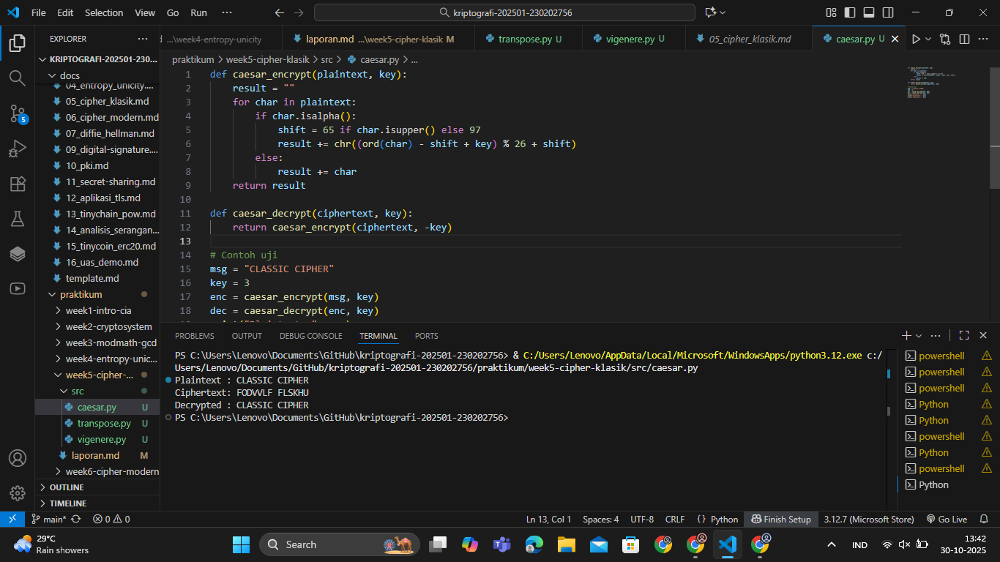
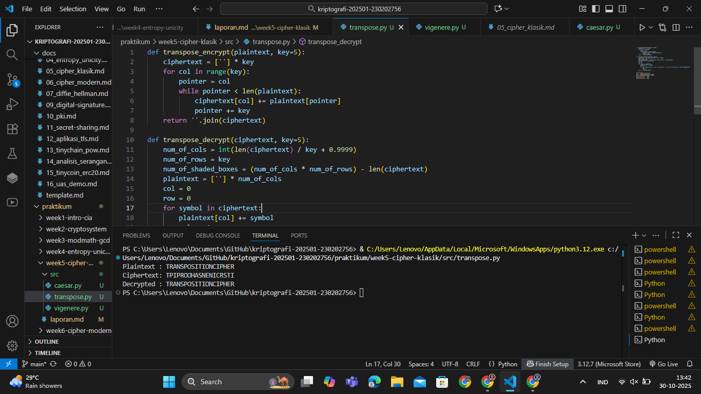
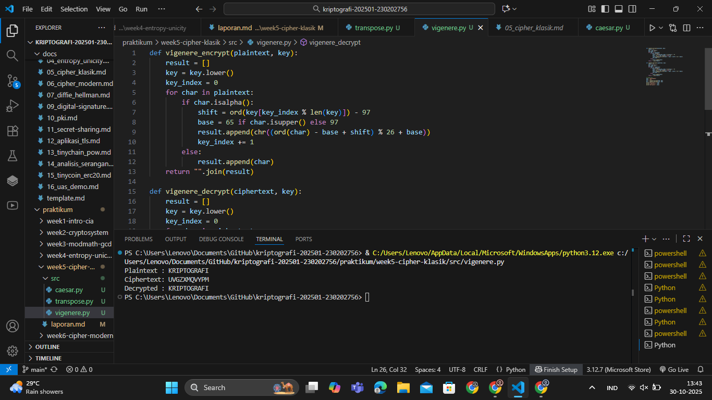

# Laporan Praktikum Kriptografi
Minggu ke-: 5  
Topik: Cipher Klasik (Caesar, Vigenère, Transposisi)
Nama: Gilas Zein Ramdani  
NIM: 230202756  
Kelas: 5IKRB  

---

## 1. Tujuan
1. Mengimplementasikan algoritma Caesar Cipher untuk proses enkripsi dan dekripsi teks.
2. Menggunakan Vigenère Cipher dengan kunci polialfabetik.
3. Mengembangkan algoritma Transposisi Cipher sederhana.
4. Menjelaskan kelemahan dan karakteristik cipher klasik dalam konteks keamanan modern.

---

## 2. Dasar Teori
Cipher klasik merupakan algoritma kriptografi awal yang bekerja dengan prinsip substitusi dan transposisi terhadap huruf-huruf plaintext.
* Cipher substitusi mengganti setiap huruf dengan huruf lain berdasarkan pola tertentu. Contohnya adalah Caesar Cipher, yang menggeser setiap huruf sebanyak k posisi pada alfabet.
* Vigenère Cipher merupakan bentuk substitusi polialfabetik, di mana pergeseran huruf bergantung pada huruf-huruf dalam kunci, bukan nilai tetap seperti pada Caesar.
* Cipher transposisi tidak mengubah huruf, tetapi mengubah urutan karakter sesuai pola kolom tertentu.
Cipher klasik mudah dipelajari namun rentan terhadap analisis frekuensi, karena pola bahasa alami masih dapat terdeteksi dalam ciphertext.

---

## 3. Alat dan Bahan
(- Python 3.12  
- Visual Studio Code / editor lain  
- Git dan akun GitHub  
- Library tambahan (misalnya pycryptodome, jika diperlukan)  )

---

## 4. Langkah Percobaan
(Tuliskan langkah yang dilakukan sesuai instruksi.  
Contoh format:
1. Membuat file `caesar.py, vigenere.py, dan transpose.py` di folder `praktikum/week5-cipher-klasik/src/`.
2. Menyalin kode program dari panduan praktikum.
3. Menjalankan program dengan perintah `python caesar.py, vigenere.py, dan transpose.py`.)

---

## 5. Source Code
caesar.py

```python
def caesar_encrypt(plaintext, key):
    result = ""
    for char in plaintext:
        if char.isalpha():
            shift = 65 if char.isupper() else 97
            result += chr((ord(char) - shift + key) % 26 + shift)
        else:
            result += char
    return result

def caesar_decrypt(ciphertext, key):
    return caesar_encrypt(ciphertext, -key)

# Contoh uji
msg = "CLASSIC CIPHER"
key = 3
enc = caesar_encrypt(msg, key)
dec = caesar_decrypt(enc, key)
print("Plaintext :", msg)
print("Ciphertext:", enc)
print("Decrypted :", dec)
``` 

transpose.py

```python
def transpose_encrypt(plaintext, key=5):
    ciphertext = [''] * key
    for col in range(key):
        pointer = col
        while pointer < len(plaintext):
            ciphertext[col] += plaintext[pointer]
            pointer += key
    return ''.join(ciphertext)

def transpose_decrypt(ciphertext, key=5):
    num_of_cols = int(len(ciphertext) / key + 0.9999)
    num_of_rows = key
    num_of_shaded_boxes = (num_of_cols * num_of_rows) - len(ciphertext)
    plaintext = [''] * num_of_cols
    col = 0
    row = 0
    for symbol in ciphertext:
        plaintext[col] += symbol
        col += 1
        if (col == num_of_cols) or (col == num_of_cols - 1 and row >= num_of_rows - num_of_shaded_boxes):
            col = 0
            row += 1
    return ''.join(plaintext)

# Contoh uji
msg = "TRANSPOSITIONCIPHER"
enc = transpose_encrypt(msg, key=5)
dec = transpose_decrypt(enc, key=5)
print("Plaintext :", msg)
print("Ciphertext:", enc)
print("Decrypted :", dec)
```

vigenere.py

```python
def vigenere_encrypt(plaintext, key):
    result = []
    key = key.lower()
    key_index = 0
    for char in plaintext:
        if char.isalpha():
            shift = ord(key[key_index % len(key)]) - 97
            base = 65 if char.isupper() else 97
            result.append(chr((ord(char) - base + shift) % 26 + base))
            key_index += 1
        else:
            result.append(char)
    return "".join(result)

def vigenere_decrypt(ciphertext, key):
    result = []
    key = key.lower()
    key_index = 0
    for char in ciphertext:
        if char.isalpha():
            shift = ord(key[key_index % len(key)]) - 97
            base = 65 if char.isupper() else 97
            result.append(chr((ord(char) - base - shift) % 26 + base))
            key_index += 1
        else:
            result.append(char)
    return "".join(result)

# Contoh uji
msg = "KRIPTOGRAFI"
key = "KEY"
enc = vigenere_encrypt(msg, key)
dec = vigenere_decrypt(enc, key)
print("Plaintext :", msg)
print("Ciphertext:", enc)
print("Decrypted :", dec)
```

---

## 6. Hasil dan Pembahasan
(- Lampirkan screenshot hasil eksekusi program (taruh di folder `screenshots/`).  
- Berikan tabel atau ringkasan hasil uji jika diperlukan.  
- Jelaskan apakah hasil sesuai ekspektasi.  
- Bahas error (jika ada) dan solusinya. 

Hasil eksekusi program Caesar Cipher:




)

---

## 7. Jawaban Pertanyaan
- Pertanyaan 1: Apa kelemahan utama Caesar dan Vigenère Cipher?
- Jawab       : Caesar Cipher mudah dipecahkan karena hanya memiliki 25 kemungkinan kunci, dan Vigenère Cipher lebih aman tetapi tetap bisa diserang dengan analisis frekuensi atau metode Kasiski jika panjang kunci diketahui.
- Pertanyaan 2: Mengapa cipher klasik mudah diserang dengan analisis frekuensi?
- Jawab       : Karena distribusi huruf pada ciphertext masih mencerminkan pola bahasa alami (seperti huruf “E” atau “A” yang sering muncul).
- Pertanyaan 2: Bandingkan substitusi dan transposisi.
- Jawab       : Substitusi mengganti karakter dengan karakter lain, Transposisi hanya menukar posisi karakter tanpa mengganti isinya, dan Kombinasi keduanya menghasilkan cipher yang lebih kuat (contohnya pada algoritma modern). 
---

## 8. Kesimpulan
Melalui praktikum ini, mahasiswa memahami penerapan cipher klasik seperti Caesar, Vigenère, dan Transposisi.
Ketiganya mudah diimplementasikan namun tidak aman untuk komunikasi modern karena dapat dipecahkan dengan analisis frekuensi dan brute-force.
---

## 9. Daftar Pustaka
(Cantumkan referensi yang digunakan.  
Contoh:  
- Katz, J., & Lindell, Y. *Introduction to Modern Cryptography*.  
- Stallings, W. *Cryptography and Network Security*.  )

---

## 10. Commit Log
(Tuliskan bukti commit Git yang relevan.  
Contoh:
```
commit abc12345
Author: Nama Mahasiswa <email>
Date:   2025-09-20

    week2-cryptosystem: implementasi Caesar Cipher dan laporan )
```
