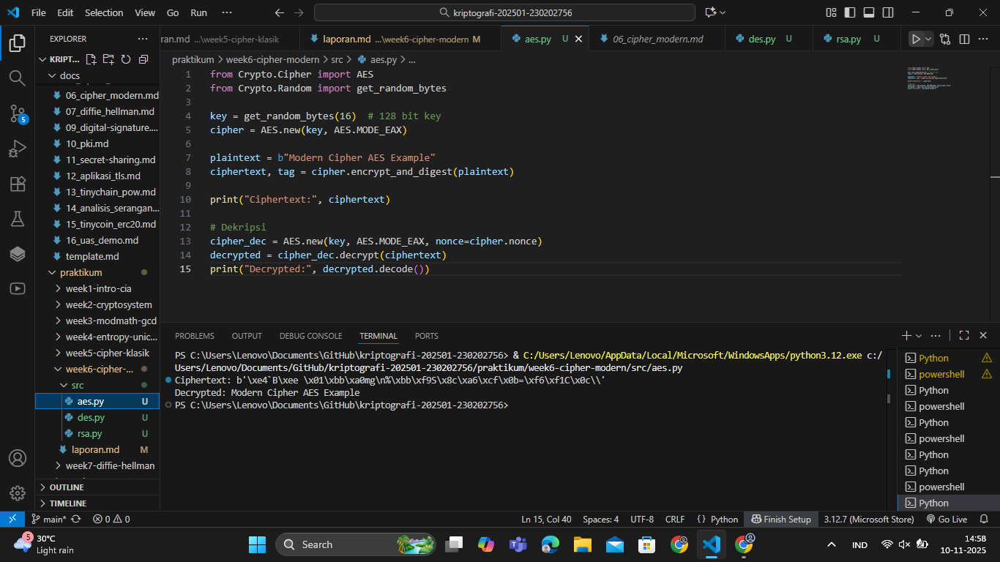
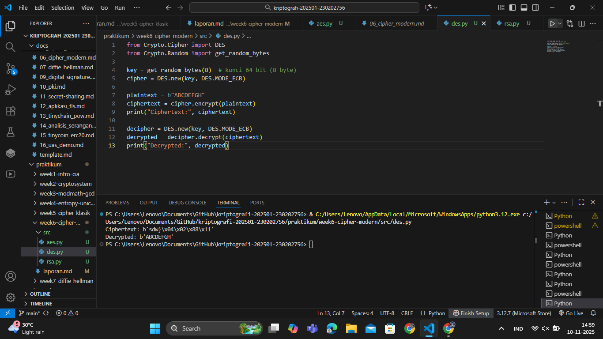
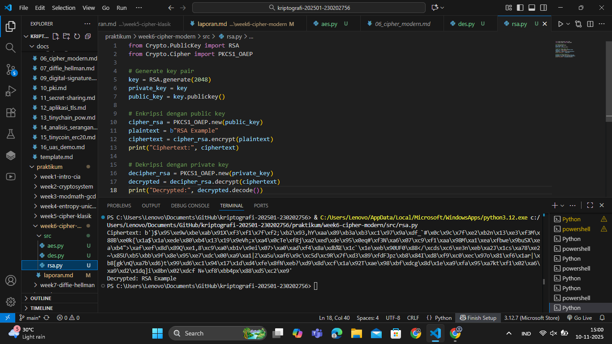

# Laporan Praktikum Kriptografi
Minggu ke-: 6  
Topik: Cipher Modern (DES, AES, RSA)
Nama: Gilas Zein Ramdani  
NIM: 230202756  
Kelas: 5IKRB

---

## 1. Tujuan
1. Mengimplementasikan algoritma AES-128 untuk melakukan enkripsi dan dekripsi data.
2. Mengimplementasikan skema RSA untuk menghasilkan pasangan kunci, melakukan enkripsi menggunakan public key, dan        dekripsi menggunakan private key.
3. Mensimulasikan penggunaan DES sebagai cipher blok klasik (opsional).
4. Memahami perbedaan antara cipher simetris dan asimetris pada konteks pengamanan data modern.

---

## 2. Dasar Teori
Cipher modern terbagi ke dalam dua kategori utama: cipher simetris dan cipher asimetris. Cipher simetris seperti DES dan AES menggunakan satu kunci untuk enkripsi dan dekripsi. DES (Data Encryption Standard) merupakan block cipher 64-bit dengan panjang kunci efektif 56-bit. Namun, karena rentan terhadap brute-force, DES telah digantikan oleh algoritma yang lebih kuat seperti AES. AES (Advanced Encryption Standard) bekerja pada blok 128 bit dengan ukuran kunci 128, 192, atau 256 bit, serta memiliki struktur SubBytes, ShiftRows, MixColumns, dan AddRoundKey yang memberikan ketahanan terhadap serangan modern.

Berbeda dengan cipher simetris, RSA adalah algoritma asimetris yang menggunakan sepasang kunci: public key (untuk enkripsi) dan private key (untuk dekripsi). RSA bergantung pada kompleksitas faktorisasi bilangan besar, di mana dua bilangan prima besar dikalikan untuk menghasilkan modulus n. Keamanan RSA berasal dari sulitnya memfaktorkan n kembali ke bilangan prima p dan q.

Ketiga algoritma ini sering digunakan dalam berbagai skema keamanan modern. DES digunakan sebagai referensi historis, AES digunakan secara luas dalam protokol TLS, VPN, dan enkripsi disk, sedangkan RSA digunakan dalam pertukaran kunci, tanda tangan digital, dan infrastruktur kunci publik (PKI).

---

## 3. Alat dan Bahan
(- Python 3.12  
- Visual Studio Code / editor lain  
- Git dan akun GitHub  
- Library tambahan (misalnya pycryptodome, jika diperlukan)  )

---

## 4. Langkah Percobaan
(Tuliskan langkah yang dilakukan sesuai instruksi.  
Contoh format:
1. Membuat file `caesar_cipher.py` di folder `praktikum/week2-cryptosystem/src/`.
2. Menyalin kode program dari panduan praktikum.
3. Menjalankan program dengan perintah `python caesar_cipher.py`.)

---

## 5. Source Code
(Salin kode program utama yang dibuat atau dimodifikasi.  
Gunakan blok kode:

```python
# contoh potongan kode
def encrypt(text, key):
    return ...
```
)

---

## 6. Hasil dan Pembahasan
(- Lampirkan screenshot hasil eksekusi program (taruh di folder `screenshots/`).  
- Berikan tabel atau ringkasan hasil uji jika diperlukan.  
- Jelaskan apakah hasil sesuai ekspektasi.  
- Bahas error (jika ada) dan solusinya. 

Hasil eksekusi program Caesar Cipher:




)

---

## 7. Jawaban Pertanyaan
- Pertanyaan 1: Perbedaan mendasar antara DES, AES, dan RSA dalam hal kunci dan keamanan.
- Jawab       : DES: cipher simetris, blok 64 bit, kunci efektif 56 bit, rentan brute-force, AES: cipher simetris, blok 128 bit, kunci 128/192/256 bit, sangat aman dan menjadi standar modern, dan RSA: cipher asimetris, menggunakan pasangan kunci, keamanan berdasarkan kesulitan faktorisasi bilangan besar.
- Pertanyaan 2: Mengapa AES lebih banyak digunakan dibanding DES di era modern?
- Jawab       : Karena AES memiliki panjang kunci lebih besar, struktur internal lebih kuat, efisien di perangkat modern, dan tidak rentan brute-force seperti DES.
- Pertanyaan 2: Mengapa RSA dikategorikan sebagai algoritma asimetris, dan bagaimana proses pembangkitan kuncinya?
- Jawab       : RSA menggunakan dua kunci berbeda (public dan private).
Proses pembangkitan: memilih dua bilangan prima besar p dan q, menghitung n = pq, menghitung φ(n), memilih e, dan mencari d sebagai invers modular dari e. 

---

## 8. Kesimpulan
Dalam praktikum ini mahasiswa berhasil mengimplementasikan algoritma DES, AES, dan RSA menggunakan Python. AES dan RSA terbukti bekerja sesuai konsep simetris dan asimetris, sementara DES digunakan sebagai referensi historis. Hasil percobaan menunjukkan seluruh algoritma menghasilkan enkripsi dan dekripsi yang benar sesuai teori.
---

## 9. Daftar Pustaka
(Cantumkan referensi yang digunakan.  
Contoh:  
- Katz, J., & Lindell, Y. *Introduction to Modern Cryptography*.  
- Stallings, W. *Cryptography and Network Security*.  )

---

## 10. Commit Log
(Tuliskan bukti commit Git yang relevan.  
Contoh:
```
commit abc12345
Author: Nama Mahasiswa <email>
Date:   2025-09-20

    week2-cryptosystem: implementasi Caesar Cipher dan laporan )
```
