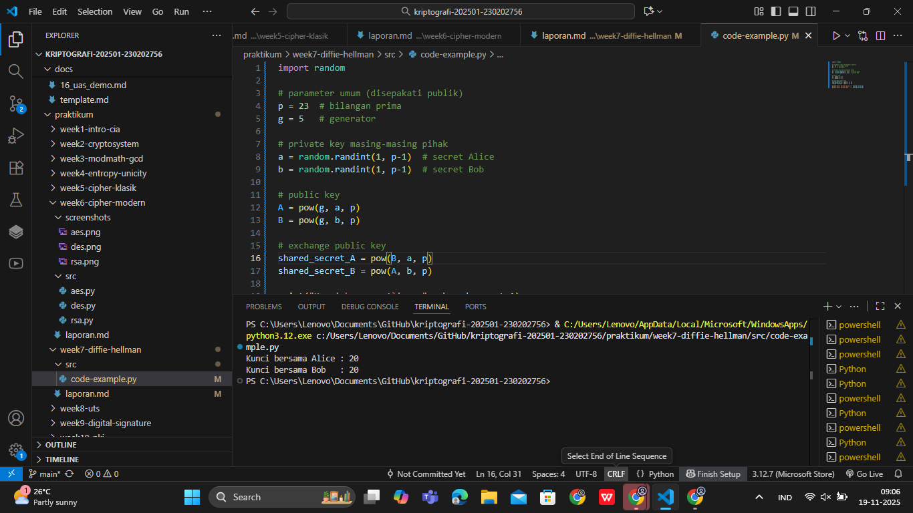

# Laporan Praktikum Kriptografi
Minggu ke-: 7  
Topik: Diffie-Hellman Key Exchange
Nama: Gilas Zein Ramdani  
NIM: 230202756  
Kelas: 5IKRB  

---

## 1. Tujuan
1. Menerapkan simulasi proses pertukaran kunci menggunakan protokol Diffie-Hellman Key Exchange.
2. Memahami konsep matematis seperti bilangan prima, generator, dan logaritma diskrit dalam proses pembentukan kunci.
3. Melakukan analisis keamanan terkait kelemahan protokol Diffie-Hellman, khususnya serangan Man-in-the-Middle (MITM).
4. Menghasilkan laporan, kode program, dan commit Git sesuai instruksi modul.

---

## 2. Dasar Teori
Diffie-Hellman adalah algoritma pertukaran kunci pertama yang memungkinkan dua pihak menghasilkan kunci rahasia yang sama meskipun berkomunikasi melalui saluran publik yang dapat disadap. Keamanannya bergantung pada sulitnya menyelesaikan Discrete Logarithm Problem (DLP).

Setiap pihak memilih kunci privat masing-masing, menghitung kunci publik, lalu bertukar. Melalui operasi modulo eksponensial, keduanya dapat menghasilkan shared secret yang identik tanpa pernah mengirimkan nilai privat.

Namun, protokol DH standar tidak menyediakan autentikasi, sehingga rawan terhadap serangan MITM. Penyerang dapat mencegat public key dan menggantinya dengan miliknya, sehingga memperoleh akses terhadap kunci rahasia kedua pihak.

---

## 3. Alat dan Bahan
(- Python 3.12  
- Visual Studio Code / editor lain  
- Git dan akun GitHub  
- Library tambahan (misalnya pycryptodome, jika diperlukan)  )

---

## 4. Langkah Percobaan
(Tuliskan langkah yang dilakukan sesuai instruksi.  
Contoh format:
1. Membuat file `diffie_hellman.py` di folder `praktikum/week7-diffie-hellman/src/`.
2. Menyalin kode program dari panduan praktikum.
3. Menjalankan program dengan perintah `python diffie_hellman.py`.)

---

## 5. Source Code
(Salin kode program utama yang dibuat atau dimodifikasi.  
Gunakan blok kode:

```python
import random

# parameter umum (disepakati publik)
p = 23  # bilangan prima
g = 5   # generator

# private key masing-masing pihak
a = random.randint(1, p-1)  # secret Alice
b = random.randint(1, p-1)  # secret Bob

# public key
A = pow(g, a, p)
B = pow(g, b, p)

# exchange public key
shared_secret_A = pow(B, a, p)
shared_secret_B = pow(A, b, p)

print("Kunci bersama Alice :", shared_secret_A)
print("Kunci bersama Bob   :", shared_secret_B)
```
)

---

## 6. Hasil dan Pembahasan
(- Lampirkan screenshot hasil eksekusi program (taruh di folder `screenshots/`).  
- Berikan tabel atau ringkasan hasil uji jika diperlukan.  
- Jelaskan apakah hasil sesuai ekspektasi.  
- Bahas error (jika ada) dan solusinya. 

Hasil eksekusi program Caesar Cipher:



)

---

## 7. Jawaban Pertanyaan
- Pertanyaan 1: Mengapa Diffie-Hellman memungkinkan pertukaran kunci melalui saluran publik?
- Jawab       : Karena nilai public key tidak dapat digunakan untuk menghitung private key tanpa menyelesaikan masalah logaritma diskrit, yang sangat sulit secara komputasional.
- Pertanyaan 2: Apa kelemahan utama Diffie-Hellman murni?
- Jawab       : Protokol ini tidak menyediakan autentikasi, sehingga rawan terhadap serangan MITM.
- Pertanyaan 2: Bagaimana cara mencegah serangan MITM pada Diffie-Hellman?
- Jawab       : Dengan menambahkan mekanisme autentikasi seperti digital signature, sertifikat CA, atau menggunakan protokol modern seperti TLS dengan Authenticated Key Exchange / ECDHE.
---

## 8. Kesimpulan
Pada praktikum ini, telah berhasil dilakukan simulasi protokol Diffie-Hellman untuk menghasilkan shared secret. Eksperimen membuktikan bahwa protokol ini aman dari penyadapan pasif, tetapi rentan terhadap serangan MITM karena kurangnya autentikasi. Implementasi nyata membutuhkan metode autentikasi tambahan.

---

## 9. Daftar Pustaka
(Cantumkan referensi yang digunakan.  
Contoh:  
- Katz, J., & Lindell, Y. *Introduction to Modern Cryptography*.  
- Stallings, W. *Cryptography and Network Security*.  )

---

## 10. Commit Log
(Tuliskan bukti commit Git yang relevan.  
Contoh:
```
commit abc12345
Author: Nama Mahasiswa <email>
Date:   2025-09-20

    week2-cryptosystem: implementasi Caesar Cipher dan laporan )
```
