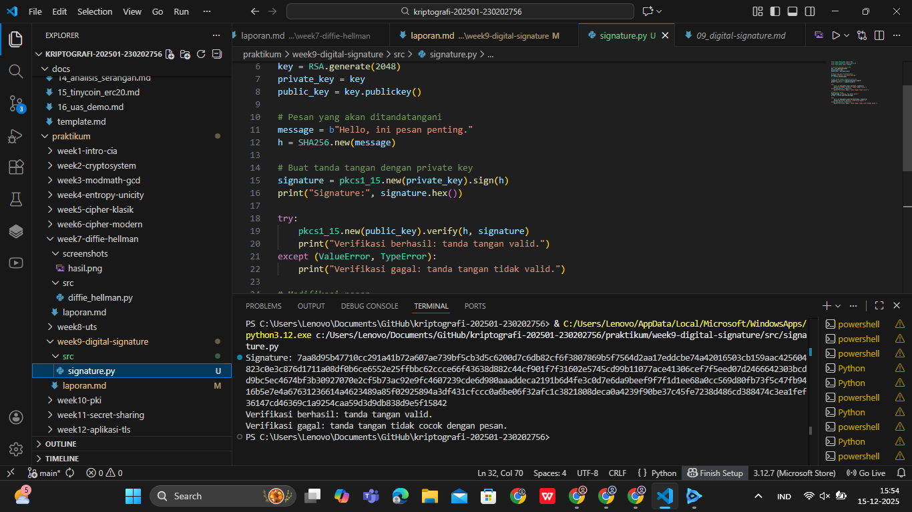

# Laporan Praktikum Kriptografi
Minggu ke-: 9  
Topik: Digital Signature (RSA)  
Nama: Gilas Zein Ramdani 
NIM: 230202756  
Kelas: 5IKRB 

---

## 1. Tujuan
Tujuan dari praktikum ini adalah untuk memahami konsep tanda tangan digital serta mengimplementasikan algoritma RSA Digital Signature menggunakan bahasa pemrograman Python. Mahasiswa diharapkan mampu membuat tanda tangan digital, melakukan verifikasi tanda tangan, serta memahami peran tanda tangan digital dalam menjamin keaslian dan integritas pesan.

---

## 2. Dasar Teori
Tanda tangan digital merupakan mekanisme kriptografi yang digunakan untuk memastikan bahwa suatu pesan benar-benar berasal dari pengirim yang sah dan tidak mengalami perubahan selama proses pengiriman. Berbeda dengan enkripsi yang bertujuan menjaga kerahasiaan pesan, tanda tangan digital berfokus pada aspek autentikasi, integritas data, dan non-repudiation.

Pada algoritma RSA, tanda tangan digital dibuat dengan cara mengenkripsi nilai hash dari pesan menggunakan private key pengirim. Proses hashing biasanya menggunakan algoritma hash kriptografis seperti SHA-256. Pihak penerima kemudian melakukan verifikasi dengan mendekripsi tanda tangan menggunakan public key pengirim dan membandingkan hasilnya dengan hash pesan yang diterima.

Jika pesan mengalami perubahan sekecil apa pun, nilai hash yang dihasilkan akan berbeda sehingga proses verifikasi gagal. Dengan demikian, tanda tangan digital memberikan jaminan bahwa pesan tidak dimodifikasi dan benar-benar dibuat oleh pemilik private key yang sah.

---

## 3. Alat dan Bahan
(- Python 3.12  
- Visual Studio Code / editor lain  
- Git dan akun GitHub  
- Library tambahan (misalnya pycryptodome, jika diperlukan)  )

---

## 4. Langkah Percobaan
(Tuliskan langkah yang dilakukan sesuai instruksi.  
Contoh format:
1. Membuat file `signature.py` di folder `praktikum/week9-digital-signature/src/`.
2. Menyalin kode program dari panduan praktikum.
3. Menjalankan program dengan perintah `python signature.py`.)

---

## 5. Source Code
(Salin kode program utama yang dibuat atau dimodifikasi.  
Gunakan blok kode:

```python
from Crypto.PublicKey import RSA
from Crypto.Signature import pkcs1_15
from Crypto.Hash import SHA256

# Generate pasangan kunci RSA
key = RSA.generate(2048)
private_key = key
public_key = key.publickey()

# Pesan yang akan ditandatangani
message = b"Hello, ini pesan penting."
h = SHA256.new(message)

# Buat tanda tangan dengan private key
signature = pkcs1_15.new(private_key).sign(h)
print("Signature:", signature.hex())

try:
    pkcs1_15.new(public_key).verify(h, signature)
    print("Verifikasi berhasil: tanda tangan valid.")
except (ValueError, TypeError):
    print("Verifikasi gagal: tanda tangan tidak valid.")

# Modifikasi pesan
fake_message = b"Hello, ini pesan palsu."
h_fake = SHA256.new(fake_message)

try:
    pkcs1_15.new(public_key).verify(h_fake, signature)
    print("Verifikasi berhasil (seharusnya gagal).")
except (ValueError, TypeError):
    print("Verifikasi gagal: tanda tangan tidak cocok dengan pesan.")
```
)

---

## 6. Hasil dan Pembahasan
(- Lampirkan screenshot hasil eksekusi program (taruh di folder `screenshots/`).  
- Berikan tabel atau ringkasan hasil uji jika diperlukan.  
- Jelaskan apakah hasil sesuai ekspektasi.  
- Bahas error (jika ada) dan solusinya. 

Hasil eksekusi program Caesar Cipher:


)

---

## 7. Jawaban Pertanyaan
- Pertanyaan 1: Apa perbedaan utama antara enkripsi RSA dan tanda tangan digital RSA?
- Jawab       : Enkripsi RSA bertujuan menjaga kerahasiaan pesan dengan mengenkripsi pesan menggunakan public key dan mendekripsinya dengan private key. Tanda tangan digital RSA bertujuan menjamin keaslian dan integritas pesan dengan menandatangani hash pesan menggunakan private key dan memverifikasinya menggunakan public key.
- Pertanyaan 2: Mengapa tanda tangan digital menjamin integritas dan otentikasi pesan?
- Jawab       : Karena tanda tangan digital dibuat dari hash pesan dan private key pengirim. Jika pesan diubah, hash akan berubah sehingga verifikasi gagal. Selain itu, hanya pemilik private key yang dapat membuat tanda tangan yang valid.
- Pertanyaan 3: Bagaimana peran Certificate Authority (CA) dalam sistem tanda tangan digital?
- Jawab       : Certificate Authority berfungsi sebagai pihak tepercaya yang mengaitkan identitas pemilik dengan public key melalui sertifikat digital, sehingga penerima pesan yakin bahwa public key tersebut benar-benar milik pengirim.
---

## 8. Kesimpulan
Berdasarkan hasil praktikum, dapat disimpulkan bahwa tanda tangan digital menggunakan algoritma RSA mampu menjamin keaslian dan integritas pesan. Perubahan pada isi pesan menyebabkan verifikasi tanda tangan gagal, sehingga sistem ini sangat efektif untuk menjaga keamanan komunikasi digital. 

---

## 9. Daftar Pustaka
(Cantumkan referensi yang digunakan.  
Contoh:  
- Katz, J., & Lindell, Y. *Introduction to Modern Cryptography*.  
- Stallings, W. *Cryptography and Network Security*.  )

---

## 10. Commit Log
```
commit e15c53a1e0ca93b267606f914d3dcd96235d95f7 (HEAD -> main, origin/main, origin/HEAD)
Author: gilaszeinramdani <gilaszeinramdani@gmail.com>
Date:   Mon Dec 15 15:59:10 2025 +0700

    week9-digital-signature
```
